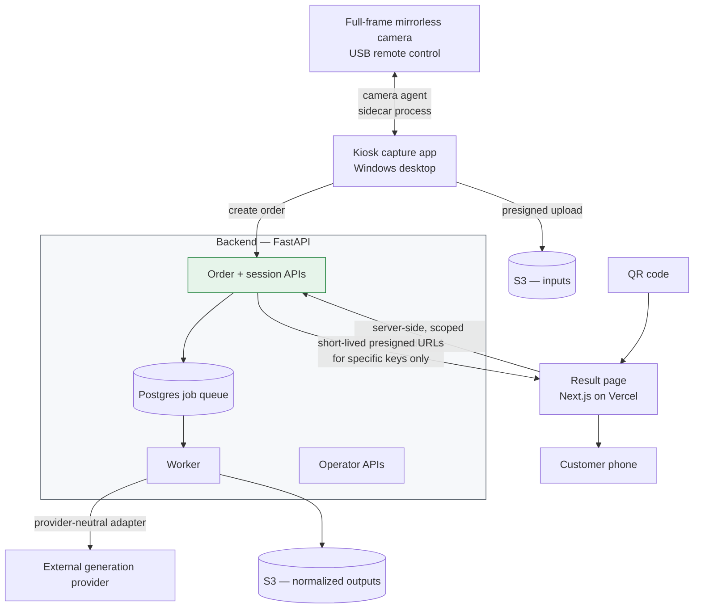

# AI Experience Platform

A physical kiosk takes your photo. Minutes later a QR code hands you an AI-generated video and sticker on your phone.

Everything between those two sentences is the system: a camera controlled from a desktop app, an upload contract, a job queue that calls a paid external generation provider, and a public result page that serves media without ever holding storage credentials.

Case studies from that platform. These are write-ups, not source — client code, credentials, and infrastructure identifiers are deliberately absent.

## The system

## Cases

| # | Case | Core problem |
|---|---|---|
| 01 | [Serving generated media without storage credentials](cases/01-serving-media-without-credentials.md) | A public result page that can never list, browse, or leak a bucket |
| 02 | [A job queue for paid, non-idempotent work](cases/02-job-queue-for-paid-work.md) | Every retry costs money and may not be safe to repeat |
| 03 | [Kiosk capture client and camera control](cases/03-kiosk-capture-client.md) | Unattended hardware, one chance to capture, no operator to fix it |

## Positions this work argued for

**Vendor neutrality has to be structural.** The generation provider was expected to change. Provider names appear in configuration, never in class names, backend types, or queue contracts — so switching is a config change and an adapter, not a schema migration.

**The tier that faces the public holds no credentials.** The result page never touches storage. It asks the backend, which signs URLs for exactly the objects belonging to that session, and nothing else.

**Retries have a budget, and exceeding it is an operator decision.** Automatic retry stops at a fixed count. Beyond that a human decides, because beyond that the failure is probably not transient and every attempt bills.

**Configuration used for a retry must be the configuration that was recorded.** A retry runs against the immutable baseline snapshot, not against whatever an operator has edited in the dashboard since.

## Stack

`Python` · `FastAPI` · `PostgreSQL` (queue and state) · `S3` · `Next.js` on Vercel · `C#` / WPF · `C++` camera agent · `Alembic`

---

## 한국어 요약

물리 키오스크가 사진을 찍습니다. 몇 분 뒤 QR 코드가 AI로 생성된 영상과 스티커를 휴대폰에 건네줍니다. **그 두 문장 사이의 전부가 이 시스템입니다** — 데스크톱 앱으로 제어되는 카메라, 업로드 계약, 유료 외부 생성 provider를 호출하는 잡 큐, 그리고 **스토리지 자격증명을 한 번도 쥐지 않고** 미디어를 서빙하는 공개 결과 페이지.

| # | 케이스 | 핵심 문제 |
|---|---|---|
| 01 | 스토리지 자격증명 없이 생성 미디어 서빙 | 버킷을 나열·탐색·유출할 수 없는 공개 결과 페이지 |
| 02 | 유료·비멱등 작업을 위한 잡 큐 | 재시도마다 돈이 나가고, 반복이 안전하지 않을 수 있음 |
| 03 | 키오스크 촬영 클라이언트와 카메라 제어 | 무인 하드웨어, 촬영 기회는 한 번, 고쳐줄 운영자 없음 |

**이 작업이 주장하는 입장**

- **벤더 중립성은 구조로 확보해야 합니다.** 생성 provider는 바뀔 것으로 예상됐습니다. 벤더 이름은 설정에만 등장하고 **클래스명·백엔드 타입·큐 계약에는 절대 등장하지 않습니다.** 그래서 교체가 스키마 마이그레이션이 아니라 설정 변경 + 어댑터 추가입니다.
- **공개를 마주하는 계층은 자격증명을 갖지 않습니다.** 결과 페이지는 스토리지를 건드리지 않습니다. 백엔드에 요청하면 백엔드가 **그 세션에 속한 객체에 대해서만** URL을 서명합니다.
- **재시도에는 예산이 있고, 초과는 운영자의 결정입니다.** 자동 재시도는 고정 횟수에서 멈춥니다. 그 너머는 사람이 정합니다. 그 지점을 넘으면 장애가 일시적이지 않을 확률이 높고, 시도마다 과금되기 때문입니다.
- **재시도에 쓰는 설정은 기록된 설정이어야 합니다.** 재시도는 대시보드에서 그 사이 수정된 값이 아니라 **불변 baseline 스냅샷**으로 실행됩니다.
