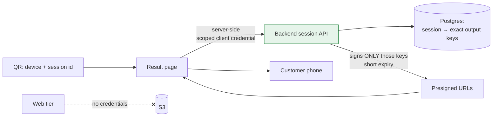

# Serving Generated Media Without Storage Credentials

**Surface** · A public page reached by scanning a QR code, on a stranger's phone
**Contents** · Someone's face, in a generated video
**Constraint** · The page must be able to show exactly one session's output and have no capability beyond that

## Context

A customer uses the kiosk, and a QR code gives them a URL containing a device identifier and a session identifier. They scan it and get their video and sticker.

That URL is printed, photographed, shared, and forwarded. It is the least controlled surface in the system, and what it leads to is personal: a video of a specific person's face.

## Problem

**The obvious implementation is a bucket link, and it is wrong in several ways at once.** Direct object URLs are permanent, guessable if keys are structured, and impossible to revoke. Making the bucket public to serve them makes every other object in it public too.

**Session identifiers in a URL are not secrets.** They appear in browser history, in screenshots, in messaging app previews, and in any analytics the page loads. Anything that treats possession of the URL as full authorization is trusting a value that travels in the clear by design.

**The web tier is the most exposed component.** A public Next.js app on a hosting platform is the thing most likely to be probed, and the thing whose dependencies you control least. It is the worst possible place to put credentials that can read a bucket.

**Provider output URLs are not a serving contract.** The generation provider returns transient URLs to its own storage. Handing those to a customer means the result page depends on a third party's retention policy, and the media disappears when they expire.

## Approach

**The web tier holds no storage credentials at all.** The result page runs server-side code that calls the backend with a scoped client credential — not a storage key. It cannot read the bucket, cannot list it, and cannot construct an object URL. If the entire web application were compromised, the attacker would gain the ability to call one backend API, not the ability to enumerate customer media.

**The backend signs specific keys, resolved from the database.** It looks up the session, reads the exact output keys recorded for it, and signs those. It never signs a prefix, never signs a pattern, and never signs anything derived from the request. The set of objects a session can reach is a database fact, not a string operation on user input — so there is no path by which a manipulated identifier reaches another session's media.

**Signed URLs are short-lived.** Long enough to load the page and play the video, short enough that a forwarded link stops working. Re-visiting the result page re-signs; sharing a URL from the address bar does not share the media indefinitely.

**Outputs are normalized into our own storage before serving.** The worker downloads the provider's transient output and re-uploads it under keys we control, at fixed known paths. Serving is therefore independent of the provider's retention, and swapping providers doesn't change the result page at all.

**Status files in storage exist only as compatibility mirrors.** Earlier in the system's life, session state was read from JSON objects in the bucket. That is still written for compatibility, but the database is authoritative and the API reads from it. Two sources of truth are tolerable only when one of them is explicitly labelled as not being one.

## What this defends against

| Attack | Why it fails |
|---|---|
| Guess or enumerate object keys | No public bucket access; keys are only reachable via signed URLs |
| Compromise the public web app | It holds no storage credential — only the ability to call one API |
| Manipulate the session identifier | Keys come from the database record for that session, not from the input |
| Reuse a forwarded link later | Signature expires |
| Provider deletes its outputs | Media was copied into our storage before it was ever served |

## What I would revisit

Possession of the URL is the authorization. That fits the product — a customer must be able to scan and view with no account and no friction — but it means a shared link is a shared video for as long as it stays fresh. If the content ever became more sensitive, the next step is a session token issued at the kiosk and bound to the first device that redeems it, accepting the support cost that comes with it.

---

## 한국어 요약

고객이 키오스크를 쓰면 QR 코드가 기기 식별자와 세션 식별자가 담긴 URL을 줍니다. 스캔하면 자기 영상과 스티커를 받습니다. 그 URL은 인쇄되고, 사진으로 찍히고, 공유되고, 또 전달됩니다. 시스템에서 통제가 가장 안 되는 표면인데, 그 끝에 있는 건 **특정 개인의 얼굴이 담긴 영상**입니다.

**어려웠던 지점**

- **가장 뻔한 구현은 버킷 링크인데, 여러 방향으로 한꺼번에 틀립니다.** 객체 직접 URL은 영구적이고, 키에 규칙이 있으면 추측할 수 있고, 폐기할 방법이 없습니다. 그걸 서빙하겠다고 버킷을 공개로 열면 안에 있는 다른 객체도 전부 공개됩니다.
- **URL 안의 세션 식별자는 비밀이 아닙니다.** 브라우저 히스토리에 남고, 스크린샷에 찍히고, 메신저 미리보기에 뜨고, 페이지가 부르는 분석 도구에도 들어갑니다. URL을 가진 것만으로 완전한 인가로 치는 설계는 애초에 평문으로 돌아다니게 되어 있는 값을 믿는 것입니다.
- **웹 계층이 가장 노출된 구성요소입니다.** 호스팅 플랫폼에 올린 공개 Next.js 앱은 가장 많이 찔러보는 대상이면서 의존성 통제력은 가장 약합니다. 버킷을 읽을 수 있는 자격증명을 두기에 최악의 자리입니다.
- **Provider 출력 URL은 서빙 계약이 못 됩니다.** 생성 provider는 자기 스토리지를 가리키는 임시 URL을 돌려줍니다. 그걸 그대로 고객에게 주면 결과 페이지가 서드파티의 보존 정책에 매이고, 만료되는 순간 미디어가 사라집니다.

**접근**

- **웹 계층은 스토리지 자격증명을 아예 갖지 않습니다.** 결과 페이지의 서버 사이드 코드가 스토리지 키가 아니라 범위 제한된 클라이언트 자격증명으로 백엔드를 호출합니다. 버킷을 읽지도, 나열하지도, 객체 URL을 만들지도 못합니다. 웹 애플리케이션 전체가 탈취돼도 공격자가 손에 넣는 건 백엔드 API 하나를 호출할 능력이지, 고객 미디어를 열거할 능력이 아닙니다.
- **백엔드는 DB에서 찾아낸 특정 키만 서명합니다.** 세션을 조회해서 거기 기록된 출력 키를 그대로 읽고, 그것만 서명합니다. prefix도, 패턴도, 요청에서 파생된 무엇도 서명하지 않습니다. 한 세션이 닿을 수 있는 객체 집합은 사용자 입력을 문자열로 주무른 결과가 아니라 **DB에 적힌 사실**입니다. 그래서 식별자를 조작해도 남의 세션 미디어로 가는 경로가 없습니다.
- **서명 URL은 수명이 짧습니다.** 페이지를 열고 영상을 재생할 만큼은 길고, 전달된 링크가 곧 안 먹힐 만큼은 짧습니다. 결과 페이지를 다시 열면 다시 서명하므로, 주소창의 URL을 넘긴다고 미디어를 무기한 넘기게 되지는 않습니다.
- **출력물은 서빙 전에 우리 스토리지로 정규화합니다.** 워커가 provider의 임시 출력을 내려받아 우리가 통제하는 고정된 키 경로로 다시 올립니다. 덕분에 서빙이 provider의 보존 정책과 무관해지고, provider를 갈아치워도 결과 페이지는 그대로입니다.
- **스토리지의 상태 파일은 호환용 미러로만 남아 있습니다.** 초기에는 세션 상태를 버킷의 JSON 객체에서 읽었습니다. 호환을 위해 계속 쓰기는 하지만 권위는 DB에 있고 API도 DB를 읽습니다. 진실의 원천이 둘인 상태는 그중 하나가 원천이 아니라고 못박아 둘 때만 견딜 만합니다.

**막아내는 것**

| 공격 | 실패하는 이유 |
|---|---|
| 객체 키 추측·열거 | 공개 버킷 접근 없음. 키는 서명 URL로만 도달 |
| 공개 웹 앱 탈취 | 스토리지 자격증명 없음 — API 하나 호출 능력뿐 |
| 세션 식별자 조작 | 키는 입력이 아니라 해당 세션의 DB 레코드에서 옴 |
| 전달받은 링크 재사용 | 서명 만료 |
| Provider가 출력 삭제 | 서빙 전에 이미 우리 스토리지로 복사됨 |

**다시 한다면** — URL을 가진 사람이 곧 인가받은 사람입니다. 계정도 마찰도 없이 스캔해서 봐야 하는 제품에는 맞는 선택이지만, 공유된 링크는 신선한 동안 공유된 영상이기도 합니다. 콘텐츠가 지금보다 민감해진다면 다음 수는 **키오스크에서 발급하고 처음 사용한 기기에 묶이는 세션 토큰**이고, 그때 늘어날 고객 문의 비용은 감수해야 합니다.
